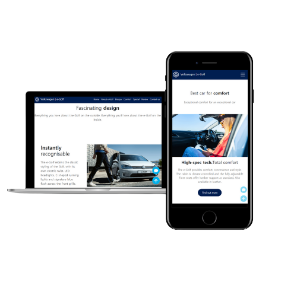

# new Volkswage e-Golf

A new car page designed for the new Volkswagen e-Golf

🔸 Github pages address: https://youmeson.github.io/bluesky_interactive_test

- Page included

  - Navigation bar
  - The main image
  - A contact form
  - Different sections
  - A footer

1. About the project

   ✅ Volkswagen e-Golf web page

2. Structure

| Page    | Description                                                                        |
| ------- | ---------------------------------------------------------------------------------- |
| Home    |  navbar transparent effect + carousel       |
| About   |  about section                             |
| About2  |  animation effect on hover |
| Design  |  toggle the show more button              |
| Special |  scroll effect using observer            |
| Contact |  form                                    |
| Footer  |  link to home(#)                          |
| Mobile1 |  menu color change when hover over  |
| Mobile2 |  Home section on mobile              |

3. Goal

✅ Navigation bar

- navbar transparent effect + scroll to section

✅ The main image

- Two main images with carousel

✅ About e-Golf and strength

- animation effect when hover over

✅ Scroll effect using observer

- change the icon color when scroll down and up

✅ form

- make a simple contact form with submit button

✅ footer

- links to home(#)

✅ Responsive design
